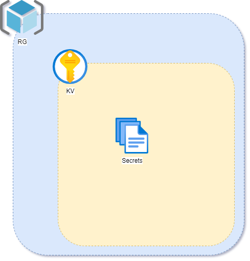
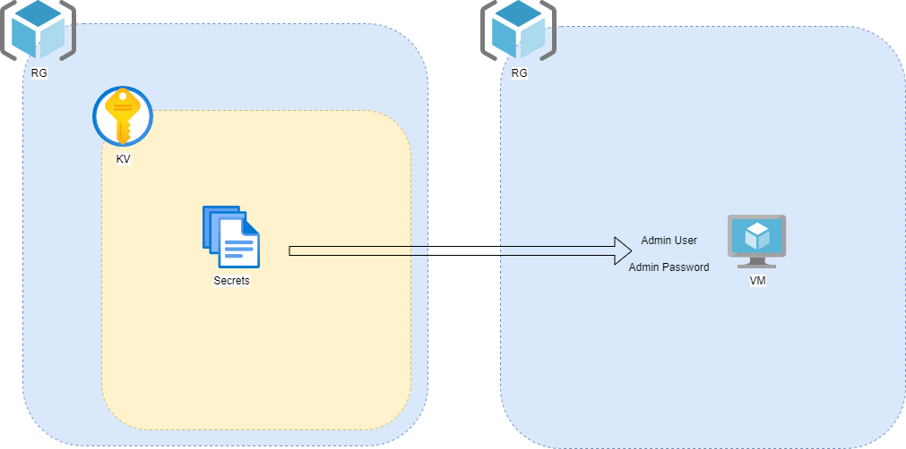

# exercise: vm with keyvault secrets #

Que vamos a desplegar en este ejercicio.

## En el ejercicio 1. ## 
Vamos a desplegar un RG con un storage account y un contenedor de blobs para almacenar el tfstate.

## En el ejercicio 2. ##
Desplegaremos un keyvault dentro de un RG con 2 secretos.

## En el ejercicio 3. ##
Desplegaremos una máquina virtual cogiendo los secretos del keyvault. Con ello, conseguiremos que nuestro despliegue contenga claves o texto sensible a posibles filtraciones involuntarias.

