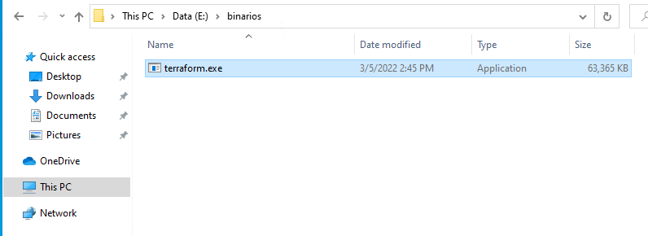
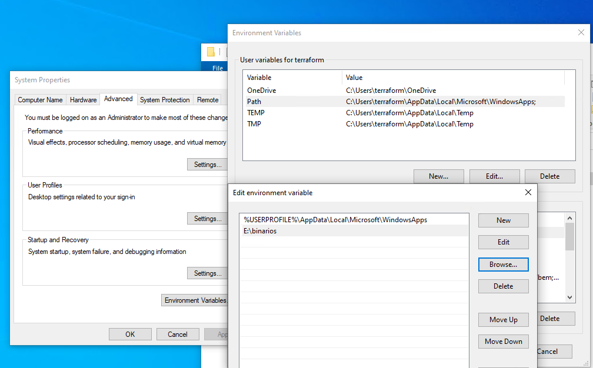
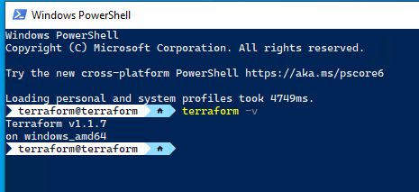
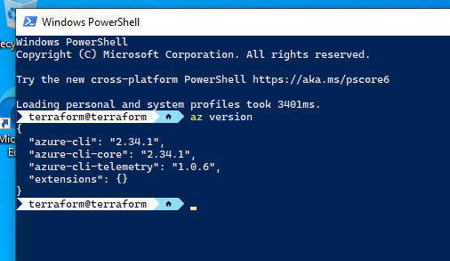

# Primeros pasos con Terraform (Windows)

## Instalación de Terraform en Windows.

1. Descargar Terraform de la página web del desarrollador: [Terraform](https://www.terraform.io/downloads "Terraform")
2. Una vez descargado Terraform, copiamos el archivo terraform.exe a una carpeta específica para los ejecutables. Por ejemplo:

3. Añadimos la carpeta a las variables de entorno de Windows:

4. Abrimos la terminal de powershell y ejecutamos: terraform -v

## Descargar AzureCLI en en Windows.

1. Accedemos al sitio web de descarga de [Azure cli](https://docs.microsoft.com/es-es/cli/azure/install-azure-cli "AZURE CLI").
2. Descargamos la versión del paquete correspondiente a nuestro OS, en nuestro caso, Windows: [https://aka.ms/installazurecliwindows](https://aka.ms/installazurecliwindows "https://aka.ms/installazurecliwindows")
3. Ejecutamos el instalador de Azure CLI y realizamos la instalación.
4. Cerramos el terminal y lanzamos otra terminal de Powershell y ejecutamos: az version

5. Ya podemos loguearnos en nuestra cuenta de de Azure con:
    `az login`

6. En caso de tener varias suscripciones: `az account set --subscription "Nombre de la suscripción"`

## Crear una carpeta para nuestro código y utilizar el IDE que más os guste:

Creamos una carpeta en otra unidad de nuestro sistema u otro lugar.

Hay diferentes IDE para empezar a desplegar con Terraform. Entre los que suelo utilizar yo, son:

- [Visual Studio Code](https://code.visualstudio.com/sha/download?build=stable&os=win32-x64 "Visual Studio Code")
- [Intellij IDEA Community Edition](https://www.jetbrains.com/idea/download/download-thanks.html?platform=windows&code=IIC "Intellij IDEA Community Edition")

Ya estamos listos para empezar a trabajar con Terraform.

----------

<!-- BEGIN_TF_DOCS -->
## Requirements

No requirements.

## Providers

No providers.

## Modules

No modules.

## Resources

No resources.

## Inputs

No inputs.

## Outputs

No outputs.
<!-- END_TF_DOCS -->
